# ESP32-S3 Motor Controller

A feature-rich, closed-loop DC motor controller built on the **ESP32-S3**, featuring automatic PID calibration, real-time RPM sensing via a photo-reflective sensor, a WebSocket-based web dashboard, and physical controls — all on a breadboard prototype.

---

## Table of Contents

- [Overview](#overview)
- [Features](#features)
- [Hardware](#hardware)
  - [Bill of Materials](#bill-of-materials)
  - [Wiring & Assembly](#wiring--assembly)
- [Web Dashboard](#web-dashboard)
- [Software](#software)
  - [Project Structure](#project-structure)
  - [Building & Flashing](#building--flashing)
  - [Configuration](#configuration)
- [Control Modes](#control-modes)
- [Calibration](#calibration)
- [Physical Controls](#physical-controls)
- [CI/CD](#cicd)
- [License](#license)

---

## Overview

This project turns an ESP32-S3 DevKit into a full motor controller with two control strategies (open-loop voltage and closed-loop RPM via PID), automatic system identification, a real-time web UI served directly from the microcontroller, and an audible + visual feedback system.

The hardware is split across **two breadboards**:

| Board | Contents |
|---|---|
| **Main board** | ESP32-S3, potentiometer, 3 push-buttons, transistor, flyback diode, decoupling capacitor, speaker circuit, power rail |
| **Sensor module** (small, portable) | Photo-reflective RPM sensor, pull-up/pull-down resistors, mounting for the sensor next to the motor |

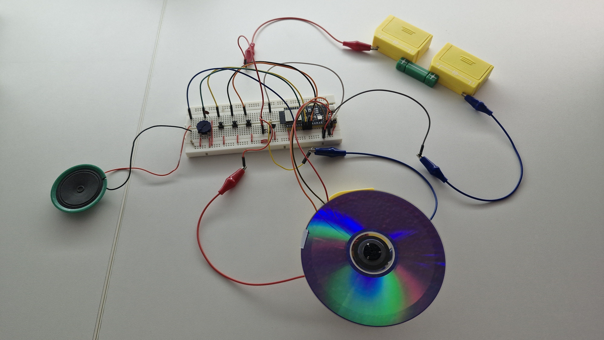

---

## Features

- **Two control modes** — open-loop PWM (voltage) and closed-loop PID (RPM target)
- **Automatic calibration** — 6-step procedure to determine minimum start duty, maximum RPM, and auto-tune Kp/Ki via step-response analysis
- **Real-time RPM measurement** via interrupt-driven photo-reflective sensor
- **WebSocket dashboard** — live telemetry, slider control, mode switching, and emergency stop, all from any browser on the same network
- **LittleFS web server** — the HTML dashboard is stored on-chip flash
- **Persistent settings** — calibration results (min duty, max RPM, Kp, Ki, timestamp) survive reboots via `Preferences` (NVS flash)
- **NTP-synced calibration timestamp** — calibration date/time is recorded and displayed in the dashboard
- **Speaker feedback** — audible clicks and tones for button presses, calibration steps, and emergency siren
- **WS2812B status LED** — hue and brightness reflect motor speed and control mode; pulsing red in emergency
- **Emergency stop** — instantly cuts motor, cancels all modes, activates siren; toggleable via button or web UI
- **Test mode** — automated speaker sweep + motor ramp-up/ramp-down + LED rainbow, useful for hardware validation
- **Debug levels** — NONE / INFO / DEBUG / VERBOSE selectable at runtime via long-press

---

## Hardware

### Bill of Materials

| # | Component | Notes |
|---|---|---|
| 1 | ESP32-S3 DevKitC-1 (N16R8) | Main microcontroller |
| 1 | DC Motor | Any voltage/current the circuit can handle (transistor + external supply rated accordingly) |
| 1 | Photo-reflective sensor (e.g. TCRT5000) | RPM detection via reflective disc |
| 1 | Potentiometer (10 kΩ) | Speed / RPM target input |
| 3 | Push-buttons | Emergency stop, mode select, calibrate/test |
| 1 | NPN transistor (e.g. 2N2222 / BC547) | Motor PWM switching |
| 1 | Flyback diode (e.g. 1N4007) | Back-EMF protection across motor terminals |
| 1 | Small speaker (8 Ω, 0.5W) | Audio feedback; driven directly from GPIO via LEDC |
| 2 | Resistor 470 Ω | Transistor base current limiting + sensor LED current limiting |
| 1 | Resistor 470 Ω | Sensor output pull-up |
| 1 | Resistor 10 kΩ | Sensor output pull-down |
| 1 | Resistor 680 Ω | Speaker series resistor |
| 1 | Ceramic capacitor 100 nF (MLCC, code 104) | ADC decoupling on potentiometer rail |
| 1 | WS2812B LED | Already on ESP32-S3 DevKit board (GPIO 48) |
| — | Jumper wires | Breadboard connections |
| — | Alligator / crocodile clip cables | Motor and battery connections |
| 1 | External power supply / battery | For the motor (separate from ESP32 USB power) |

### Wiring & Assembly

#### Pin Assignments

| Signal | GPIO |
|---|---|
| Status LED (WS2812B) | 48 |
| Potentiometer (ADC) | 15 |
| Calibrate button | 16 |
| Mode button | 17 |
| Emergency stop button | 18 |
| Motor PWM (LEDC ch 2) | 14 |
| Speaker (LEDC ch 0) | 4 |
| RPM sensor input (interrupt) | 12 |

#### Circuit Diagram

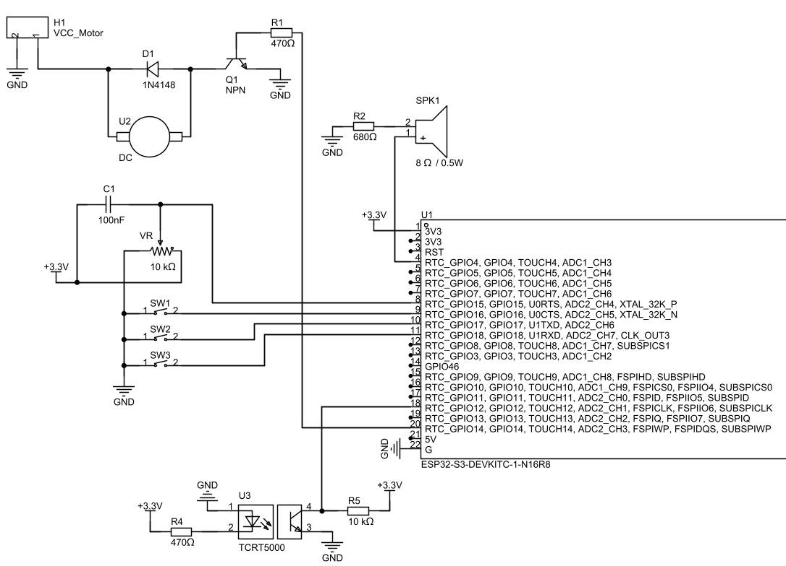

#### Main Breadboard

The ESP32-S3 sits centrally. The potentiometer is connected between 3.3 V and GND with the wiper going to GPIO 15 through a 100 nF MLCC decoupling cap. Three tactile buttons connect their respective GPIOs to GND (internal pull-ups enabled in firmware). The motor switching circuit uses a single NPN transistor with a 470 Ω base resistor from GPIO 14, the motor across collector/external supply, and a flyback diode across the motor terminals. The speaker is driven from GPIO 4 with a 680 Ω series resistor.

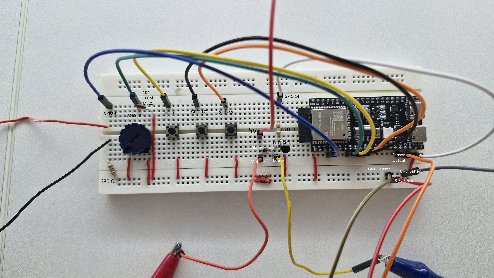
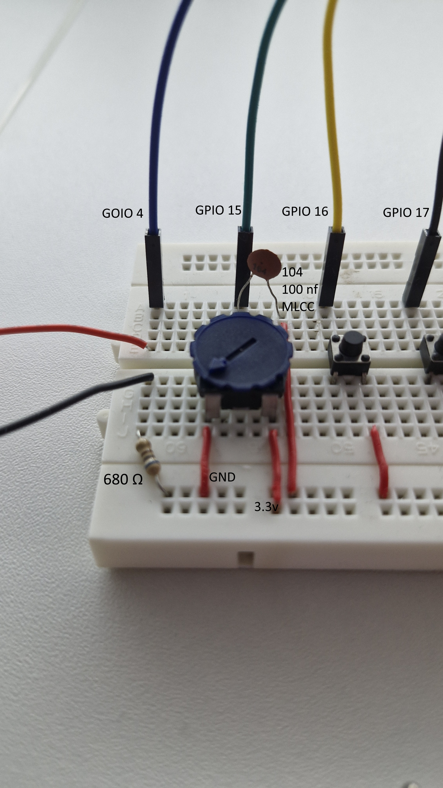
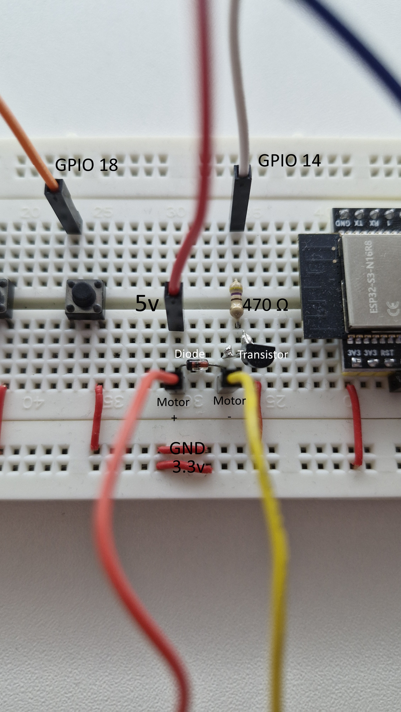
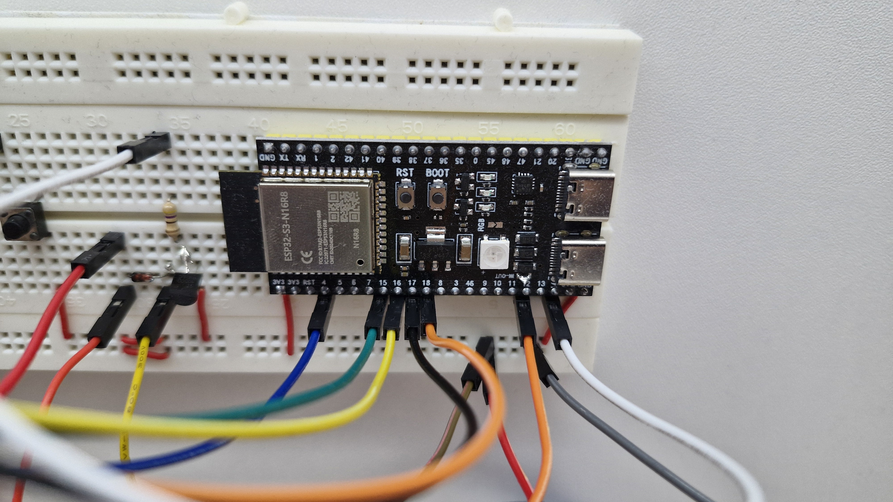

#### Sensor Module (portable mini breadboard)

The photo-reflective sensor has its LED anode driven through a 470 Ω resistor from 3.3 V. The collector output feeds GPIO 12 via a voltage divider / pull configuration (470 Ω pull-up, 10 kΩ pull-down). This small board clips onto the motor mount so the sensor faces the reflective stripe on the rotating disc.

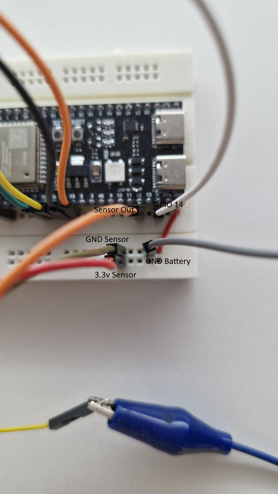
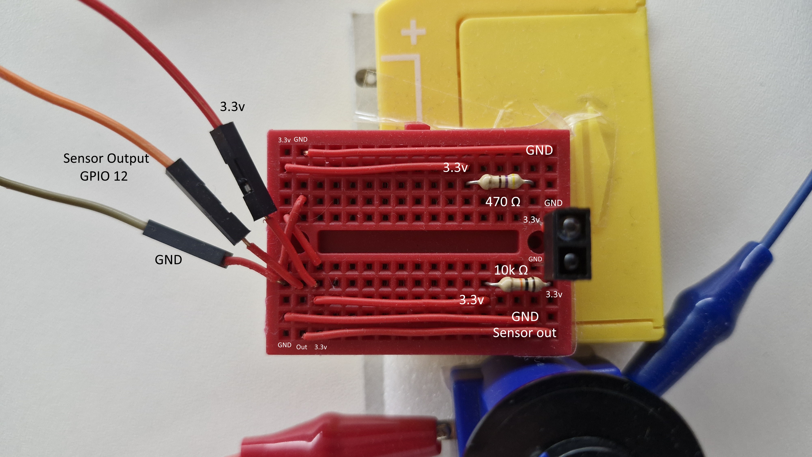

#### Motor + Sensor Assembly

This prototype uses a simple paper mount to align the motor and sensor. It serves as a functional baseline, though a more rigid setup (e.g., a 3D-printed bracket) would enhance stability. Note that the photo-reflective sensor module is fully independent and can be repurposed for other RPM measurement tasks.

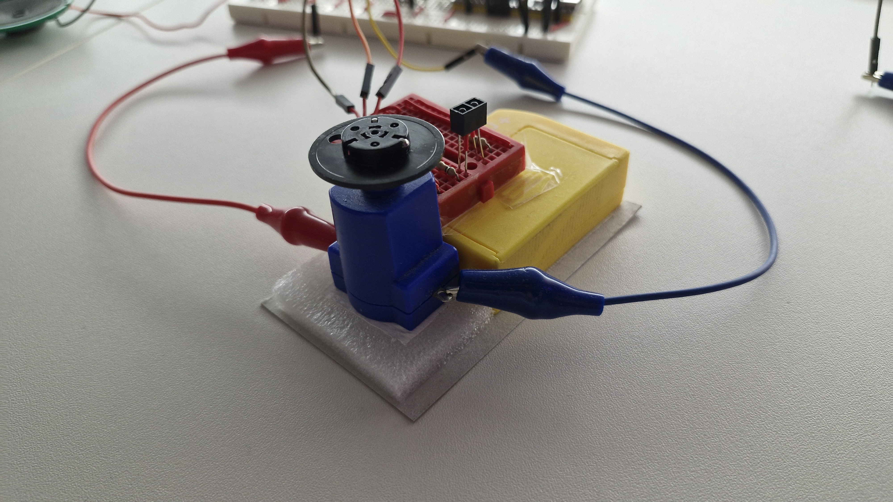

> **Safety note:** The motor's external supply GND must be shared with the ESP32 GND. Keep motor power traces away from sensitive analog lines. The flyback diode is mandatory.

---

## Web Dashboard

The dashboard is served from LittleFS at `/` and communicates via WebSocket at `ws://<esp-ip>/ws`. It receives a JSON telemetry packet every 200 ms and can send commands back to the ESP32.

| State | Screenshot |
|---|---|
| Calibrating (step 3/6) | 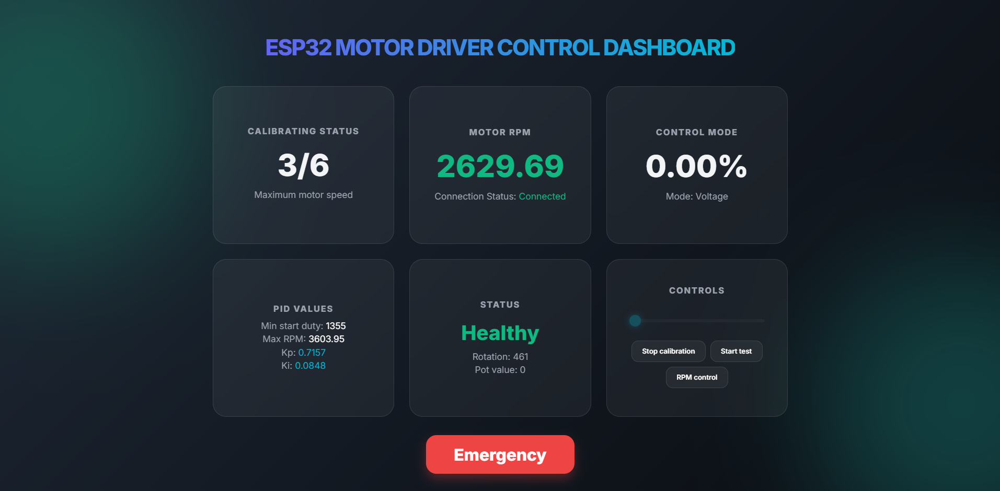 |
| RPM control mode active | 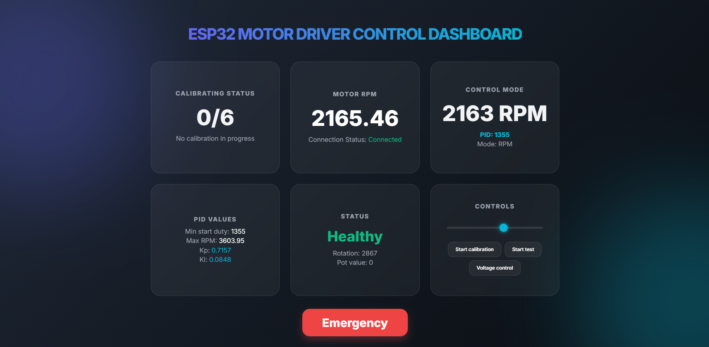 |
| Emergency stop engaged | 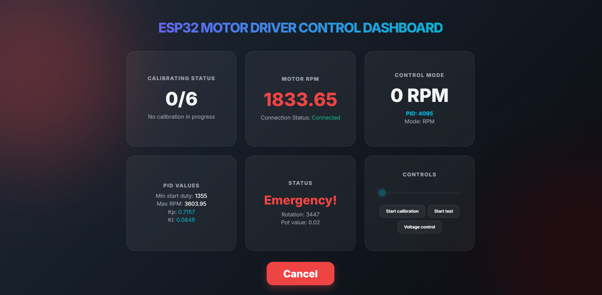 |
| Test mode running | 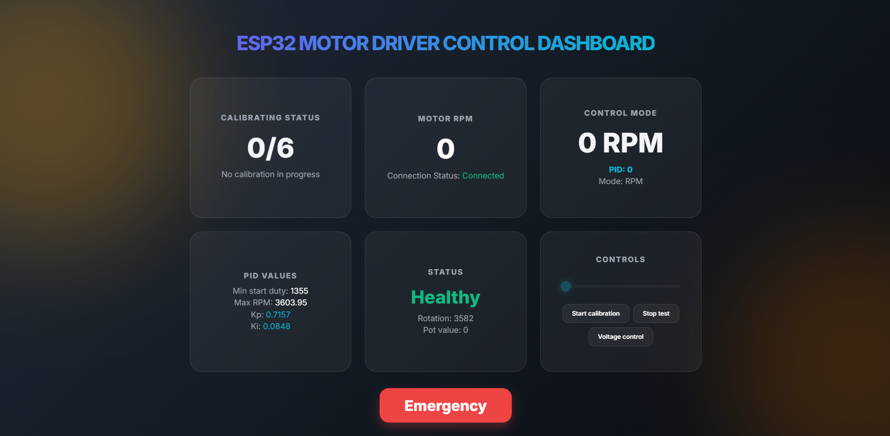 |

**Dashboard cards:**

- **Calibrating Status** — current step (0–6) and description; last calibration date/time
- **Motor RPM** — live smoothed RPM with trend colour (green = stable, red = decelerating)
- **Control Mode** — current target (% duty or RPM) and PID output when in RPM mode
- **PID Values** — min start duty, max RPM, Kp, Ki
- **Status** — healthy / emergency; rotation counter; potentiometer ADC value
- **Controls** — speed slider, calibration toggle, test toggle, mode toggle

The background glow colour shifts dynamically: cyan/indigo in normal operation, green during calibration, amber during test, and pulsing red during emergency.

---

## Software

### Project Structure

```
├── src/
│   ├── main.cpp          # Setup, loop, button handling, LED, WebSocket broadcast
│   ├── motor.cpp/.h      # PWM control, potentiometer reading, PID loop, ISR
│   ├── calibrate.cpp/.h  # 6-step auto-calibration state machine
│   ├── test.cpp/.h       # Hardware self-test routine
│   ├── websocket.cpp/.h  # WebSocket event handler
│   ├── globals.cpp/.h    # All shared state variables
│   ├── config.h          # Pin definitions, LEDC channels, ADC constants
│   └── secrets.h         # WiFi credentials (not committed, see secrets.h.example)
├── data/
│   └── index.html        # Web dashboard (uploaded to LittleFS)
├── platformio.ini
└── .github/workflows/main.yml
```

### Building & Flashing

**Prerequisites:** [PlatformIO](https://platformio.org/) (CLI or VS Code extension)

```bash
# 1. Clone the repository
git clone https://github.com/LarsEsDoch/esp32-motor-controller.git
cd esp32-motor-controller

# 2. Create your WiFi credentials file
cp src/secrets.h.example src/secrets.h
# Edit src/secrets.h with your SSID and password

# 3. Build firmware
pio run

# 4. Upload filesystem (web dashboard)
pio run --target uploadfs

# 5. Upload firmware
pio run --target upload

# 6. Monitor serial output
pio device monitor
```

After booting, the ESP32 prints its IP address over serial. Open that address in any browser on the same network.

### Configuration

All hardware pin assignments and tunable constants live in `src/config.h`:

```cpp
#define MOTOR_PIN    14   // PWM output to transistor base circuit
#define SENSOR_PIN   12   // RPM sensor interrupt input
#define SPEAKER_PIN   4   // Audio feedback

const float ADC_MIN       = 50.0f;    // Potentiometer dead-zone low
const float ADC_MAX       = 4046.0f;  // Potentiometer dead-zone high
const float ADC_TOLERANCE = 100.0f;   // Change threshold to trigger speed update
const float INTEGRATOR_CLAMP = 500.0f;
```

WiFi credentials go in `src/secrets.h` (excluded from version control via `.gitignore`):

```cpp
#define WIFI_SSID "your-ssid"
#define WIFI_PASS "your-password"
```

---

## Control Modes

Toggle between modes via the **Mode button** (short press) or the **"RPM control / Voltage control"** button in the web UI.

### Voltage Mode (open-loop)

The potentiometer position maps linearly to a PWM duty cycle (0–4095, 12-bit LEDC). The minimum start duty determined during calibration is used as the lower bound so the motor always overcomes static friction when the pot is above the dead-zone.

### RPM Mode (closed-loop PID)

The potentiometer maps to a target RPM (0 – `maxRPM`). A PI controller calculates the required PWM duty every loop iteration:

```
error     = targetRPM - smoothedRPM
integrator = clamp(integrator + error, ±INTEGRATOR_CLAMP)
output    = Kp * error + Ki * integrator
```

If the motor has stalled at a non-zero target, a start-kick pulse at `minStartDuty` is applied automatically.

---

## Calibration

Start calibration with a **short press of the Calibrate button** or via the web UI. The 6-step procedure runs autonomously:

| Step | Action |
|---|---|
| 1 | Wait for full standstill (5 consecutive zero-RPM samples, 500 ms apart) |
| 2 | Ramp PWM up from 500 until motor spins reliably → records `minStartDuty` |
| 3 | Apply full PWM (4095), wait for RPM to stabilise → records `maxRPM` |
| 4 | Apply 50 % PWM (2048), wait for stable RPM → records `rpmAt50` |
| 5 | Apply 80 % PWM (3276), wait for stable RPM → records `rpmAt80`, computes system gain K and time constant τ → calculates Kp and Ki |
| 6 | Wait for **Calibrate button press** to confirm and save to NVS flash |

Calculated values are persisted across reboots. The calibration timestamp is fetched from an NTP server and displayed in the dashboard.

---

## Physical Controls

| Button | Short press (< 3 s) | Long press (≥ 3 s) |
|---|---|---|
| **Emergency** | Toggle emergency stop | — |
| **Mode** | Toggle Voltage ↔ RPM mode | Cycle debug level (NONE → INFO → DEBUG → VERBOSE) |
| **Calibrate** | Start / cancel calibration | Toggle test mode |

In **emergency stop**, the motor is immediately cut, all modes are cancelled, the speaker plays a continuous siren, and the status LED pulses red. A second press (button or web UI) cancels the stop.

---

## CI/CD

A GitHub Actions workflow (`.github/workflows/main.yml`) runs on every push and pull request. It installs PlatformIO, generates a dummy `secrets.h`, and compiles the firmware to catch build errors early. No hardware or flashing is involved in CI.

---

## License

This project is released under the [GNU GPL](LICENSE).
